```mermaid
%%{init: {'flowchart': {'rankSpacing': 10, 'nodeSpacing': 10}} }%%
flowchart TB;
    1([1])
    2([2])
    3([3])
    4([4])
    5([5])
    6([6])
    7([7])
    8([8])
    9([9])
    10([10])
    11([11])
    12([12])
    13([13])
    14([14])
    15([15])
    16([16])
    17([17])
    18([18])
    19([19])
    20([20])
    21([21])
    22([22])
    23([23])

    1 -- t --> 2
    2 -- t --> 3
    2 -- s --> 4
    3 -- t --> 4
    4 -- t --> 5
    5 -- t --> 6
    5 -- s --> 7
    6 -- t --> 7
    7 -- t --> 8
    7 -- s --> 9
    8 -- t --> 9
    9 -- t --> 10
    9 -- s --> 11
    10 -- t --> 11
    11 -- t --> 12
    11 -- s --> 15
    12 -- t --> 13
    12 -- s --> 14
    13 -- t --> 14
    14 -- t --> 15
    15 -- t --> 16
    15 -- s --> 17
    16 -- t --> 17
    17 -- t --> 18
    17 -- s --> 19
    18 -- t --> 19
    19 -- t --> 20
    19 -- s --> 21
    20 -- t --> 21
    21 -- t --> 22
    21 -- s --> 23
    22 -- t --> 23
```

# Rapport de TP -- Tests fonctionnels et structurels
**ILU4 -- Université Paul Sabatier -- 2025–2026**

**Auteurs :** Logan Larroux, Loay Younes, Manolo Sardó

---

## Table des matières

1. [Spécifications fonctionnelles](#1-spécifications-fonctionnelles)
2. [Suite de tests](#2-suite-de-tests)
3. [Couverture](#3-couverture)
4. [Détection de défauts](#4-détection-de-défauts)
5. [Script de test](#5-script-de-test)
6. [Test de mutation](#6-test-de-mutation)
7. [Bilan](#7-bilan)

---

## Abstract

Nous avons analysé la fonction `TrianglesClassifier` à travers une approche combinée de tests fonctionnels (classes d'équivalence, valeurs aux limites) et de tests structurels (couverture JaCoCo, test de mutation). Nous avons identifié un défaut dans l'implémentation originale, démontré la capacité des tests aux limites à le révéler, et utilisé le test de mutation pour mettre en lumière une lacune dans la suite de tests. Enfin, nous avons discuté des implications de ces résultats sur la qualité du programme et l'efficacité des techniques de test employées.

## 0. Introduction

Ce rapport présente une analyse détaillée de la fonction `TrianglesClassifier`, qui classifie un triangle en fonction des longueurs de ses côtés. Nous avons suivi une méthodologie rigoureuse pour définir les spécifications fonctionnelles, construire une suite de tests exhaustive, mesurer la couverture structurelle, et évaluer la robustesse de la suite via un test de mutation. Les résultats obtenus permettent d'identifier les défauts présents dans l'implémentation originale et d'évaluer l'efficacité des différentes techniques de test utilisées.

```java
int typeTriangle(int a, int b, int c) {
    if(a < 0 || b < 0 || c < 0) return 0;
    int type = 0;
    if(a == b) type+=1;
    if(a == c) type+=2;
    if(b == c) type+=3;
    if(type == 0) {
        if(a + b <= c || a + c <= b || b + c <= a)
            return 0;
        return 1;
    }
    if(type > 3) return 3;
    if(type == 1 && a + b > c) return 2;
    if(type == 2 && a + c > b) return 2;
    if(type == 3 && b + c > a) return 2;
    
    return 0;
}
```

## 1. Spécifications fonctionnelles

**Contexte :** La fonction reçoit trois entiers $a$, $b$, et $c$ représentant les longueurs des côtés d'un triangle.

| Exigence | Description              | Détail                                                                                                                      | Retour |
|----------|--------------------------|-----------------------------------------------------------------------------------------------------------------------------|--------|
| E1.1a    | $a$ négatif              | $a < 0$, ce qui rend impossible la construction d'un triangle.                                                              | 0      |
| E1.2b    | $b$ négatif              | $b < 0$, ce qui rend impossible la construction d'un triangle.                                                              | 0      |
| E1.3c    | $c$ négatif              | $c < 0$, ce qui rend impossible la construction d'un triangle.                                                              | 0      |
| E1.4a    | $a$ nul                  | $a = 0$, ce qui rend impossible la construction d'un triangle.                                                              | 0      |
| E1.4b    | $b$ nul                  | $b = 0$, ce qui rend impossible la construction d'un triangle.                                                              | 0      |
| E1.4c    | $c$ nul                  | $c = 0$, ce qui rend impossible la construction d'un triangle.                                                              | 0      |
| E1.5c    | Inég. $a+b$ non resp.    | $a+b \leq c$, ce qui rend impossible la construction d'un triangle.                                                         | 0      |
| E1.5a    | Inég. $b+c$ non resp.    | $b+c \leq a$, ce qui rend impossible la construction d'un triangle.                                                         | 0      |
| E1.5b    | Inég. $c+a$ non resp.    | $c+a \leq b$, ce qui rend impossible la construction d'un triangle.                                                         | 0      |
| E2       | Triangle scalène         | $a \neq b$, $b \neq c$, $a \neq c$, triangle avec trois côtés de longueurs toutes différentes.                              | 1      |
| E3.1c    | Isocèle $a=b \neq c$     | $a = b \neq c$, triangle avec exactement deux côtés de même longueur.                                                       | 2      |
| E3.2a    | Isocèle $a=c \neq b$     | $a = c \neq b$, triangle avec exactement deux côtés de même longueur.                                                       | 2      |
| E3.3b    | Isocèle $b=c \neq a$     | $b = c \neq a$, triangle avec exactement deux côtés de même longueur.                                                       | 2      |
| E4       | Triangle équilatéral     | $a = b = c$, triangle avec trois côtés de même longueur.                                                                    | 3      |

**Conditions de validité d'un triangle :**

Tous les côtés doivent être strictement positifs :
$$\begin{cases} a > 0 \\ b > 0 \\ c > 0 \end{cases}$$

L'inégalité triangulaire doit être vérifiée :
$$\begin{cases} a + b > c \\ a + c > b \\ b + c > a \end{cases}$$

### 1.1 Graphe de flot de contrôle

Pour mieux visualiser les chemins d'exécution possibles, nous avons construit le graphe de flot de contrôle de la fonction `typeTriangle`. Chaque noeud représente une instruction ou un bloc d'instructions, et chaque arc représente une transition possible entre ces blocs en fonction des conditions évaluées.

```java
public static int typeTriangle(int a, int b, int c) { // 1
    if(a < 0 || b < 0 || c < 0)                       // 2
        return 0;                                     // 3
    int type = 0;                                     // 4
    if(a == b)                                        // 5
        type = type + 1;                              // 6
    if(a == c)                                        // 7
        type = type + 2;                              // 8
    if(b == c)                                        // 9
        type = type + 3;                              // 10
    if(type == 0) {                                   // 11
        if(a + b <= c || a +  c <= b || b + c <= a)   // 12
            return 0;                                 // 13
        return 1;                                     // 14
    }                                                 // 14
    if(type > 3)                                      // 15
        return 3;                                     // 16
    if(type == 1 && a + b > c)                        // 17
        return 2;                                     // 18
    if(type == 2 && a + c > b)                        // 19
        return 2;                                     // 20
    if(type == 3 && b + c > a)                        // 21
        return 2;                                     // 22
    return 0;                                         // 23
}                                                     // 23
```



---

## 2. Suite de tests

### 2.1 Classes d'équivalence

| Paramètre               | Classe valide                             | Classe invalide                                 |
|-------------------------|-------------------------------------------|-------------------------------------------------|
| Valeur de $a$           | $a > 0$ (CV1)                             | $a \leq 0$ (CI1)                                |
| Valeur de $b$           | $b > 0$ (CV2)                             | $b \leq 0$ (CI2)                                |
| Valeur de $c$           | $c > 0$ (CV3)                             | $c \leq 0$ (CI3)                                |
| Inégalité triangulaire  | $a+b > c$ et $a+c > b$ et $b+c > a$ (CV4) | $\neg(a+b > c$ et $a+c > b$ et $b+c > a)$ (CI4) |

### 2.2 Valeurs aux limites

| ID   | Description                               | $a$ | $b$ | $c$ | Retour attendu | Retour réel (`TrianglesClassifier`) |
|------|-------------------------------------------|-----|-----|-----|----------------|-------------------------------------|
| VL1  | Borne inf. invalide de $a$                | 0   | 2   | 2   | 0              | 2 ❌ (isocèle à côté nul)           |
| VL2  | Borne inf. valide de $a$                  | 1   | 2   | 2   | 2              | 2 ✅                                |
| VL3  | Juste au-dessus de la borne inf. de $a$   | 2   | 2   | 2   | 3              | 3 ✅                                |
| VL4  | Au niveau de la borne inf. de $b$         | 2   | 4   | 2   | 0              | 0 ✅ (triangle plat)                |
| VL5  | Borne inf. invalide de $b$                | 2   | 0   | 2   | 0              | 2 ❌ (isocèle à côté nul)           |
| VL6  | Borne inf. valide de $b$                  | 2   | 1   | 2   | 2              | 2 ✅                                |
| VL7  | Juste au-dessus de la borne inf. de $b$   | 2   | 2   | 2   | 3              | 3 ✅                                |
| VL8  | Au niveau de la borne inf. de $c$         | 2   | 2   | 4   | 0              | 0 ✅ (triangle plat)                |
| VL9  | Borne inf. invalide de $c$                | 2   | 2   | 0   | 0              | 2 ❌ (isocèle à côté nul)           |
| VL10 | Borne inf. valide de $c$                  | 2   | 2   | 1   | 2              | 2 ✅                                |
| VL11 | Juste au-dessus de la borne inf. de $c$   | 2   | 2   | 2   | 3              | 3 ✅                                |
| VL12 | Au niveau de la borne inf. de $a$         | 4   | 2   | 2   | 0              | 0 ✅ (triangle plat)                |
| VL13 | Inég. $a+b$ non respectée                 | 2   | 2   | 5   | 0              | 0 ✅                                |
| VL14 | Inég. $a+b$ respectée                     | 3   | 3   | 5   | 2              | 2 ✅                                |
| VL15 | Inég. $b+c$ non respectée                 | 5   | 2   | 2   | 0              | 0 ✅                                |
| VL16 | Inég. $b+c$ respectée                     | 5   | 3   | 3   | 2              | 2 ✅                                |
| VL17 | Inég. $c+a$ non respectée                 | 2   | 5   | 2   | 0              | 0 ✅                                |
| VL18 | Inég. $c+a$ respectée                     | 3   | 5   | 3   | 2              | 2 ✅                                |
| VL19 | Triangle partiellement nul ($a$, $b$)     | 0   | 0   | 1   | 0              | 0 ✅                                |
| VL20 | Triangle partiellement nul ($b$, $c$)     | 1   | 0   | 0   | 0              | 0 ✅                                |
| VL21 | Triangle partiellement nul ($c$, $a$)     | 0   | 1   | 0   | 0              | 0 ✅                                |
| VL22 | Triangle nul                              | 0   | 0   | 0   | 0              | 3 ❌ (triangle nul)                 |
| VL23 | Triangle scalène plat ($a + b = c$)       | 1   | 2   | 3   | 0              | 0 ✅                                |
| VL24 | Triangle scalène plat ($b + c = a$)       | 2   | 3   | 1   | 0              | 0 ✅                                |
| VL25 | Triangle scalène plat ($c + a = b$)       | 3   | 1   | 2   | 0              | 0 ✅                                |

---

## 3. Couverture

### 3.1 Recodage de la fonction

La mesure de couverture est effectuée sur la suite de tests définie en section 2, mais en distinguant deux versions de la fonction :

- **`TrianglesClassifier`** : l'implémentation originale fournie dans l'énoncé, qui contient un défaut (utilisation de `< 0` au lieu de `<= 0` pour la validation des côtés).
- **`TrianglesClassifierCorrected`** : une version corrigée développée par nos soins, dans laquelle la condition de garde est remplacée par `a <= 0 || b <= 0 || c <= 0`.

Ce recodage est nécessaire pour deux raisons. D'abord, la version originale présente des comportements incorrects sur les cas aux limites (isocèles à côté nul et triangle nul), ce qui laisse certaines branches structurellement atteignables dans la spécification, mais jamais exercées dans la pratique. Ensuite, le test de mutation (section 6) s'appuie sur la version corrigée comme référence : générer des mutants à partir d'une base défectueuse reviendrait à mesurer l'écart par rapport à un comportement lui-même erroné.

```java
int typeTriangle(int a, int b, int c) {
    if(a <= 0 || b <= 0 || c <= 0) return 0;
    int type = 0;
    if(a == b) type+=1;
    if(a == c) type+=2;
    if(b == c) type+=3;
    if(type == 0) {
        if(a + b <= c || a + c <= b || b + c <= a)
            return 0;
        return 1;
    }
    if(type > 3) return 3;
    if(type == 1 && a + b > c) return 2;
    if(type == 2 && a + c > b) return 2;
    if(type == 3 && b + c > a) return 2;
    
    return 0;
}
```

### 3.2 Résultats de couverture (JaCoCo)

| Classe                        | Instructions manquées | Instructions couvertes | Branches manquées | Branches couvertes | Lignes manquées | Lignes couvertes | Complexités manquées | Complexités couvertes |
|-------------------------------|-----------------------|------------------------|-------------------|--------------------|-----------------|------------------|----------------------|-----------------------|
| `TrianglesClassifier`         | 2                     | 78                     | 4                 | 30                 | 1               | 13               | 4                    | 14                    |
| `TrianglesClassifierCorrected`| 0                     | 80                     | 0                 | 34                 | 0               | 14               | 0                    | 18                    |

### 3.3 Analyse

La suite de tests atteint une **couverture totale** (instructions, branches, lignes, complexité cyclomatique) sur la version corrigée `TrianglesClassifierCorrected`. Cela confirme que les cas de test construits en section 2 sont suffisants pour exercer l'intégralité du flot de contrôle de la fonction spécifiée.

Sur la version originale `TrianglesClassifier`, trois branches restent partiellement couvertes, et une non couverte. Ces branches correspondent aux dernières conditions du code, composées de `&&` (_"et court-circuité"_), dans lesquelles la première condition est évaluée à `false` (ex. `type == 1`), ce qui empêche l'évaluation de la seconde condition (`a + b > c`) et donc l'exercice de la branche `true` correspondante. Le dernier noeud n'est structurellement pas atteignable sans modifier la condition de garde.

Le graphe de flot de contrôle de la section 1.1 permet de visualiser ces résultats. Chaque noeud et chaque arc est exercé dans la version corrigée, ce qui correspond à une couverture complète des 23 noeuds et 26 arcs. En revanche, dans la version originale, les arcs issus du noeud 2 ne sont pas tous empruntés correctement : le chemin menant au retour 0 (noeud 3) n’est jamais suivi pour les valeurs nulles, ce qui explique les branches manquantes relevées par JaCoCo.

---

## 4. Détection de défauts

Deux cas d'entrée produisent un résultat incorrect dans `TrianglesClassifier` :

**Cas 1 -- Triangle nul ($a = b = c = 0$, cas VL22).** La fonction retourne `3` au lieu de `0`. L'implémentation ne rejette pas les valeurs nulles (condition `< 0` strictement négative), si bien que `a = b = c = 0` passe la condition de garde, accumule `type = 6` (1 + 2 + 3), puis déclenche `type > 3` -> `return 3`. Ce cas combine les exigences E1.4a, E1.4b, E1.4c et E1.5a, E1.5b, E1.5c.

**Cas 2 -- Triangle isocèle à côté nul ($a = 0, b = 2, c = 2$ et permutations, cas VL1, VL5, VL9).** La fonction retourne `2` au lieu de `0`. Pour le même motif, la condition de garde ne filtre pas les zéros : `a = 0, b = 2, c = 2` donne `type = 3` (car `b == c`), puis `b + c > a` est vrai -> `return 2`. Ce cas combine E1.4a (ou E1.4b/E1.4c) avec E3.3b (ou E3.1c/E3.2a).

Ces deux anomalies sont détectées par les tests aux limites (VL1, VL5, VL9, VL122), qui ciblent précisément la borne inférieure du domaine de validité des côtés.

---

## 5. Script de test

### 5.1 Architecture générale

Le script de test est implémenté en Java et se compose de quatre éléments principaux :

- **`ITriangleClassifier`** : interface fonctionnelle (avec `@FunctionalInterface`) définissant la signature `int classify(int a, int b, int c)`. Elle permet de passer n'importe quelle implémentation -- originale, corrigée ou mutante -- comme paramètre de méthode via une référence de méthode ou une lambda.

- **`RunTest`** : classe utilitaire qui lit un fichier de tests au format `a b c résultat_attendu` (un cas par ligne), invoque le classificateur sur chaque triplet, compare le résultat obtenu au résultat attendu, et produit un fichier de sortie listant chaque cas avec son verdict `PASS` ou `FAIL`. La méthode accepte un paramètre `lazy` : en mode paresseux, l'exécution s'interrompt dès le premier échec, sans écrire de fichier de sortie. Ce comportement est exploité dans `Main` pour ne conserver que les mutants qui passent l'intégralité de la suite et ainsi éviter de parasiter l'analyse avec des mutants manifestement défectueux.

- **`MutantGenerator`** : classe qui génère dynamiquement des mutants à partir du code source de `TrianglesClassifierCorrected`. Pour chaque mutation (ou combinaison de mutations), elle effectue un remplacement textuel dans le source, compile le résultat en mémoire via l'API `javax.tools.JavaCompiler`, charge la classe générée dans un `URLClassLoader` isolé, et retourne une instance de `ITriangleClassifier` par réflexion. Cette approche évite toute dépendance à un outil externe de mutation, ce qui permet une grande maléabilité dans les mutations, ainsi qu'une comptabilité directe avec JaCoCo.

- **`Main`** : point d'entrée orchestrant l'ensemble. Il construit la liste de tous les cas à tester -- les deux implémentations de référence, puis les 28 mutants simples, puis les $28 \times 28 = 784$ mutants doubles -- et exécute `RunTest` sur chacun. Seuls les mutants ayant passé tous les tests (mode `lazy`) sont affichés dans le rapport final.

### 5.2 Format des fichiers de test

Le fichier d'entrée (`valeurs_test_IN.txt`) contient une ligne par cas de test, au format :

```
a b c résultat_attendu
```

Le fichier de sortie produit par `RunTest` reprend chaque cas sous la forme :

```
a b c -> résultat_obtenu [PASS|FAIL]
```

### 5.3 Choix de conception

L'usage d'une interface fonctionnelle pour le classificateur rend le script indépendant de toute implémentation concrète. L'ajout d'un nouveau mutant ne nécessite que d'enrichir la tablse `MUTATIONS` dans `Main` ; aucune modification du moteur de test n'est requise. La compilation dynamique dans `MutantGenerator` permet d'exécuter l'intégralité du cycle (génération, compilation, chargement, test) en une seule passe JVM, ce qui facilite également l'instrumentation JaCoCo sur les classes mutantes.

Dans un premier temps, les mutants sont créés, compilés et stockés dans une liste. Puis, tous les tests sur tous les mutants sont exécutés. Cette approche en deux étapes est inefficace, car elle génère et compile les mutants et les stocke sans savoir s'ils survivront ou non. Le _"faible"_ nombre de mutants (812) rend cependant ce choix moins catastrophique que s'il avait été question de dizaines de milliers de mutants. Une optimisation possible serait de générer et tester les mutants un par un, en mode `lazy`, pour éviter de stocker des mutants manifestement défectueux.

---

## 6. Test de mutation

### 6.1 Création des mutants

Les mutants ont été produits manuellement en appliquant des **opérateurs de mutation relationnels** à la version corrigée `TrianglesClassifierCorrected`. Les opérateurs utilisés remplacent chaque opérateur de comparaison (`<=`, `<`, `==`, `!=`, `>`, `>=`) par un autre opérateur de la même famille, sur chaque condition de la fonction.

Vingt-huit mutations élémentaires ont été définies (table `MUTATIONS` dans `Main`). Elles ciblent :
- la condition de garde ($a \le 0$, $b \le 0$, $c \le 0$),
- les conditions d'égalité pour la détection du type ($a = b$, $a = c$, $b = c$),
- les inégalités triangulaires ($a + b \le c$, etc.),
- les seuils de discrimination du type final ($\text{type} = 0$, $\text{type} > 3$, $\text{type} = 1$, $\text{type} = 2$, $\text{type} = 3$) et leurs inverses.

En plus des 28 mutants d'ordre 1, tous les couples de mutations ont été générés, soit $28 \times 28 = 784$ mutants d'ordre 2, pour un total de **812 mutants**.

Le choix de ne pas utiliser d'outil dédié (PIT, µJava, etc.) est motivé par deux raisons (déjà mentionnées dans la section 5.3) :
- D'une part, cela permet un contrôle précis sur les mutations appliquées et leur encodage dans le nom de la classe générée, ce qui est nécessaire pour corréler les résultats de mutation avec les rapports JaCoCo individuels.
- D'autre part, la génération dynamique via `MutantGenerator` permet d'instrumenter chaque classe mutante avec JaCoCo dans le même processus JVM, sans configuration externe supplémentaire.

### 6.2 Mutants survivants

Un mutant est dit **survivant** s'il passe l'intégralité de la suite de tests -- c'est-à-dire que, pour chaque cas de test, il produit le même résultat que la spécification. Un mutant survivant révèle une lacune de la suite : il existe un défaut que les tests ne détectent pas ; ou dans la perspective inverse, la structure de l'implémentation est suffisamment incorrecte pour que les tests ne puissent pas distinguer le comportement du mutant de celui de la version corrigée.

Parmi les 812 mutants générés, **aucun ne survit**. Tous sont tués par au moins un cas de test. Les tests aux limites (VL1, VL5, VL9, VL22) détectent les mutations sur la condition de garde.

Certains tests se montrent essentiels pour tuer des mutants spécifiques. Par exemple, les tests VL23, VL24 et VL25 servent à tuer les mutants ayant ces mutations élémentaires :

| Mutation            | Transformation              |
|---------------------|-----------------------------|
| `MaPbLEc_to_aPbLTc` | $a + b \le c \to a + b < c$ |
| `MaPcLEb_to_aPcLTb` | $a + c \le b \to a + c < b$ |
| `MbPcLEa_to_bPcLTa` | $b + c \le a \to b + c < a$ |

Ou une combinaison de mutations élémentaires :

| Mutation            | Transformation              |
|---------------------|-----------------------------|
| `MaPbLEc_to_aPbLTc` | $a + b \le c \to a + b < c$ |
| `MaPcLEb_to_aPcLTb` | $a + c \le b \to a + c < b$ |
| `MbPcLEa_to_bPcLTa` | $b + c \le a \to b + c < a$ |
| `MaPbLEc_to_aPbGTc` | $a + b \le c \to a + b > c$ |
| `MaPcLEb_to_aPcGTb` | $a + c \le b \to a + c > b$ |
| `MbPcLEa_to_bPcGTa` | $b + c \le a \to b + c > a$ |

Beaucoup de mutants survivants atteignent une **couverture structurelle de 100%** (zéro branche manquée, zéro ligne manquée), identique à celle de `TrianglesClassifierCorrected`. Ce résultat illustre une limite fondamentale de la couverture structurelle : une couverture à 100% des branches ne garantit pas l'absence de défauts sémantiques.

En effet, les mutations $\le \to <$ sur les inégalités triangulaires ne créent pas de nouvelles branches dans le graphe de flot de contrôle -- elles modifient uniquement la condition d'évaluation d'une branche existante. La suite de tests en vigueur exerce bien chaque branche dans les deux sens (`true` et `false`), mais uniquement avec des valeurs pour lesquelles le résultat est identique entre la version originale et le mutant. La différence de comportement n'est observable qu'au point de frontière $a + b = c$, qui n'est pas couvert par les cas de test actuels.

---

## 7. Bilan

### 7.1 Le programme fourni est-il correct ?

Non. L'implémentation `TrianglesClassifier` fournie dans l'énoncé contient un défaut : la condition de garde `if(a < 0 || b < 0 || c < 0)` utilise une inégalité stricte, alors que la spécification requiert de rejeter les valeurs nulles.

La condition correcte est `if(a <= 0 || b <= 0 || c <= 0)`. Ce défaut entraîne des résultats incorrects pour au moins quatre cas de test (VL1, VL5, VL9, VL22).

Outre qu'elle ne respecte pas la spécification fonctionnelle, l'implémentation est également incorrecte d'un point de vue structurelle : elle est bien trop complexe, avec des redondances dans la logique de classification (accumulation de `type`), et une organisation peu claire des conditions. Ce qui implique de devoir faire énormément de tests inutiles. La version corrigée `TrianglesClassifierCorrected` que nous avons développée -- en reprenant la même structure -- est donc aussi incorrecte que l'originale, mais elle respecte la spécification et permet de mieux illustrer les techniques de test.

### 7.2 Quelles techniques permettent de détecter les anomalies ?

Les **tests aux valeurs aux limites** (section 2.2) sont la technique la plus efficace pour détecter les anomalies de cette fonction. En ciblant précisément la borne inférieure du domaine, ils révèlent immédiatement le comportement incorrect sur les côtés nuls. Les classes d'équivalence seules auraient pu manquer ces cas si les bornes n'avaient pas été explicitement incluses.

Le **test de mutation** a permis de valider la robustesse de la suite. L’ajout des cas dégénérés (VL23–VL25) a rendu la suite capable de tuer tous les mutants, y compris ceux portant sur les inégalités triangulaires. Aucune lacune n’a été identifiée dans la version finale de la suite. Le test de mutation se révèle ainsi indispensable pour évaluer objectivement la qualité d’une batterie de tests, au-delà de la simple couverture structurelle.

### 7.3 Quelles techniques sont les plus laborieuses ?

Le **test de mutation** est de loin la technique la plus coûteuse. La génération de 28 mutations élémentaires et de leurs $28 \times 28 = 784$ combinaisons produit 812 mutants, chacun nécessitant une compilation dynamique et l'exécution de la suite complète. Même avec l'optimisation _lazy_ (arrêt au premier échec), le volume de calcul et la mémoire nécessaire sont significatifs. Sans outillage dédié, la définition manuelle des opérateurs de mutation et l'analyse des résultats demandent également un effort de conception non négligeable (mais bien plus adapté à un contexte spécifique).

### 7.4 Commentaires

Ce TP illustre concrètement la complémentarité des techniques de test. Les tests fonctionnels (classes d'équivalence, valeurs aux limites) permettent de dériver une suite à partir de la spécification, indépendamment du code. La couverture structurelle garantit qu'aucun chemin d'exécution n'est ignoré. Le test de mutation, enfin, évalue la _qualité_ de la suite en simulant des défauts réels et en vérifiant que chacun est détecté. Aucune de ces trois techniques n'est suffisante seule : leur combinaison permet d'obtenir un niveau de confiance élevé dans la correction du programme.

Un point notable est que la couverture à 100% des branches n'implique pas l'absence de mutants survivants : c’est seulement après avoir enrichi la suite avec des cas dégénérés (VL23–VL25) que tous les mutants ont été tués. Cela montre que la couverture structurelle est une condition nécessaire mais non suffisante pour la qualité d'une suite de tests.